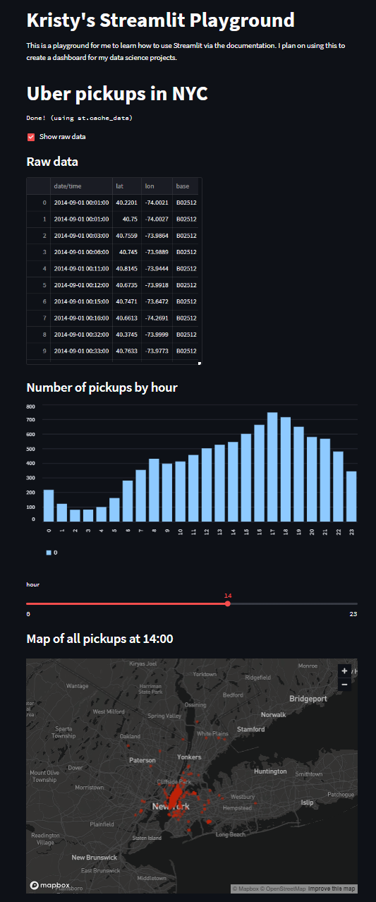

# streamlit-playground

Exploring the capabilities of Streamlit for data science purposes. https://streamlit.io/

## Resources

- [Cheatsheet](https://daniellewisdl-streamlit-cheat-sheet-app-ytm9sg.streamlit.app/)
- [Docs - API Reference](https://docs.streamlit.io/library/api-reference)
- [Docs - create an app](https://docs.streamlit.io/library/get-started/create-an-app)

## Command to run:

```shell
streamlit run streamlit-playground.py
streamlit run uber_pickups.py
```

## Run demo:

```shell
streamlit run https://raw.githubusercontent.com/streamlit/demo-uber-nyc-pickups/master/streamlit_app.py
```


